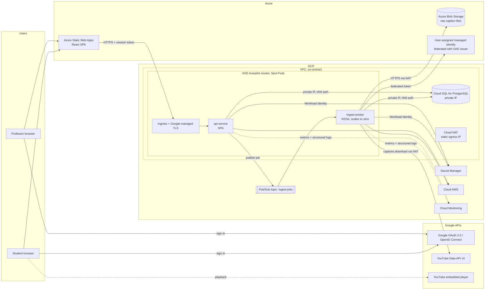

# Timestamp Caption Search: A Multi-Cloud, Cloud-Native Service for Keyword Search of Lecture Video Transcripts

**Milestone 1 — Project Proposal**
CS 6030 Cloud Computing, Western Michigan University
Team: Theodore Podewil, Joshua Jubenville, Andrew Wojciechowski

---

## Abstract

Recorded lectures are now a core study resource, but finding the moment a concept was discussed means scrubbing through hours of video. Timestamp Caption Search lets students search the spoken content of their professors' YouTube lectures by keyword and jumps straight to the matching moment in an embedded player. Professors sign in with Google, authorize read access to their videos' captions, and submit lecture links. The system fetches the captions through the YouTube Data API, indexes them with timestamps in PostgreSQL full-text search, and serves search results that open the video at the exact second the term was spoken. Timestamp Caption Search runs as containerized microservices on Google Kubernetes Engine (GKE), with its database, message queue, and secrets on Google Cloud next to the services that use them. The frontend and the raw-caption archive are on Microsoft Azure. Ingestion and search scale horizontally and independently, matching the bursty, academic-calendar-driven demand of a university. We will evaluate the system on functional correctness, autoscaling behavior under synthetic load, observability, security controls, and cost compared with a single always-on virtual machine sized for peak load.

**Domain:** Higher Education
**Clouds:** Google Cloud Platform (GCP) and Microsoft Azure

---

## I. Introduction and Problem Definition

### A. Problem

Universities record lectures for review, accessibility, and hybrid learning, and many instructors publish them to YouTube. YouTube generates captions for these videos, but it does not let a student search across a course's lectures for a term and land on the moment it was said. A student who wants to review "lambda calculus" has to guess which of fifteen lectures covered it, then scrub through that video.

### B. Goal

Make lecture videos that professors have uploaded to YouTube searchable by keyword through their transcripts. For every match, return the video and the timestamp where the keyword was spoken, and play the video from that point in an embedded YouTube player. Timestamp Caption Search never hosts video itself.

### C. Workflow

1. A professor uploads a lecture to their own YouTube channel.
2. The professor signs in to Timestamp Caption Search with their Google account and grants the app permission to read their videos' captions.
3. The professor creates a course and submits one or more YouTube video links.
4. Timestamp Caption Search retrieves each video's caption track through the YouTube Data API.
5. The timestamped caption segments are stored and indexed for keyword search.
6. A student signs in with Google and enters a search term.
7. Timestamp Caption Search returns the matching videos, timestamps, and a highlighted snippet of the surrounding text.
8. The student selects a result, and the embedded player starts at that timestamp.

### D. Why Cloud-Native

Demand for Timestamp Caption Search is highly variable:

- **Ingestion demand** follows professors' schedules and comes in bursts: after class, at the start of a semester, and when a professor bulk-imports a playlist.
- **Search demand** follows students' schedules and peaks on weekday evenings and before exams. It drops close to zero between semesters.

A single monolithic server would have to be sized for the exam-week peak and would sit mostly idle the rest of the year. Timestamp Caption Search instead splits ingestion and search into separately scalable services on Kubernetes. Each service scales out under load and back in when idle, so compute cost follows actual usage.

### E. Scope

| In scope | Out of scope (future work) |
|---|---|
| YouTube videos that the signed-in professor owns and that have a caption track (manual or auto-generated) | Generating captions ourselves (e.g., Whisper speech-to-text) |
| Keyword and phrase search using PostgreSQL full-text search | Semantic, vector, or hybrid search, and comparisons between search methods |
| Google sign-in for professors and students | Video hosting, non-YouTube platforms, LMS integration |
| Embedded YouTube playback at the matched timestamp | Mobile apps |

---

## II. System Architecture

### A. Architecture Diagram



### B. Components

**Frontend: React SPA on Azure Static Web Apps.** A single-page app built with React and Vite. It provides Google sign-in, a professor view for managing courses and videos with their ingestion status, and a student search view. Results play in the YouTube IFrame Player using the `start` parameter, so Timestamp Caption Search serves no video bytes. Static Web Apps provides a global CDN, free TLS, and GitHub Actions integration on its free tier.

**API service (`api`): container on GKE.** A stateless REST service written in Python with FastAPI. It:
- validates Google ID tokens and issues a short-lived application session token;
- completes the professor's OAuth authorization-code flow for the YouTube scope;
- creates courses and videos and publishes ingestion jobs to Pub/Sub;
- runs search queries against PostgreSQL.

A Kubernetes Horizontal Pod Autoscaler scales the service on CPU utilization. The cluster runs in GKE Autopilot mode, so Google provisions capacity for new pods automatically and bills only for each pod's resource requests; both services run as Spot Pods.

**Ingestion worker (`ingest-worker`): container on GKE.** It consumes jobs from Pub/Sub, obtains a fresh access token from the professor's stored refresh token, calls `captions.list` and `captions.download`, and archives the raw WebVTT file in Azure Blob Storage. It then parses the cues into timestamped segments and writes them to PostgreSQL. KEDA scales the worker on Pub/Sub subscription backlog, down to zero replicas when the queue is empty. Failed jobs go to a dead-letter topic. A job that hits the YouTube quota is retried with backoff instead of failing.

**Message queue: Google Cloud Pub/Sub.** Pub/Sub decouples the user-facing API from the slow, quota-limited YouTube calls. It absorbs bulk imports, provides at-least-once delivery, and supplies the backlog signal that drives worker autoscaling.

**Data tier: Cloud SQL for PostgreSQL (relational).** PostgreSQL stores users, roles, courses, videos, ingestion status, and transcript segments. The instance is in the same region and VPC as the GKE cluster and has only a private IP, so every search query stays on Google's internal network. Built-in full-text search (`tsvector`, a GIN index, `websearch_to_tsquery`, `ts_rank`, `ts_headline`) handles keyword and phrase queries, so no separate search engine is needed. A relational store suits the strongly relational data and enforces ownership through foreign keys.

Simplified schema:

```sql
users    (id, google_sub UNIQUE, email, role CHECK (role IN ('professor','student','admin')))
courses  (id, owner_id → users, title, term)
videos   (id, course_id → courses, youtube_id UNIQUE, title, status, ingested_at)
segments (id, video_id → videos, start_ms, end_ms, text,
          tsv tsvector GENERATED ALWAYS AS (to_tsvector('english', text)) STORED)
-- GIN index on segments(tsv)
```

Caption cues are only a few seconds long, so a phrase can be split across two cues. The worker therefore merges cues into overlapping windows of about 20 seconds before indexing. Each result points to the start of its window.

**Object storage: Azure Blob Storage.** Blob Storage holds the original caption files. The database can be rebuilt from these files if the segmenting or indexing logic changes, without spending YouTube API quota again. The worker writes each file once, and the files are read back only when the database is rebuilt, never while serving a user request, so cross-cloud latency to Blob Storage does not affect users.

**Secrets: Google Secret Manager and Cloud KMS.** Secret Manager stores the Google OAuth client secret and any remaining service credentials. A Cloud KMS key encrypts professors' refresh tokens before they are written to the database. Both are in the same project as the workloads that use them.

**Observability: Google Cloud Monitoring.** See Section V.

### C. Network and Cross-Cloud Communication

| Path | Mechanism |
|---|---|
| Browser → API (Azure SWA origin → GCP) | HTTPS to a GKE Ingress with a Google-managed certificate. The API allows CORS only from the Static Web Apps origin. |
| GKE → Cloud SQL (within GCP) | Private IP through Private Service Access in the same VPC and region. Connections go through the Cloud SQL Auth Proxy sidecar, which uses IAM database authentication, so no database password exists. |
| GKE → Secret Manager / Cloud KMS (within GCP) | GKE Workload Identity maps each Kubernetes service account to a Google service account with read access to its own secrets only. |
| GKE → Azure Blob Storage (cross-cloud) | HTTPS through Cloud NAT. The storage account firewall allows only the NAT's static egress IP. The worker authenticates as an Azure user-assigned managed identity through workload identity federation: the managed identity has a federated credential that trusts the GKE cluster's OIDC issuer, so the worker's Kubernetes service-account token is exchanged for a Microsoft Entra token. No Azure key or SAS token is stored anywhere. |
| GitHub Actions → GCP and Azure | OIDC federation to both clouds: GCP Workload Identity Federation, and a second user-assigned managed identity with a federated credential trusting GitHub. The repository holds no long-lived cloud keys. |

---

## III. Technology Services

| Layer | Requirement | Service / Tool | Provider | Justification |
|---|---|---|---|---|
| Frontend | React / Angular / Vue / Next.js on a managed host | React + Vite on **Azure Static Web Apps** | Azure | Always-free tier, global CDN, automatic TLS, first-class GitHub Actions deploy |
| Application tier | Containers + Docker on AKS / EKS / GKE | Docker images on **GKE Autopilot** (Spot Pods), stored in **Artifact Registry** | GCP | No nodes to manage: Google provisions capacity per pod and bills only for pod resource requests, so workers scaled to zero cost nothing; GKE free tier covers the management fee for one Autopilot cluster; Spot Pods are 60–91% cheaper; hardened defaults (Workload Identity, shielded nodes); supports HPA and KEDA |
| Messaging | — | **Cloud Pub/Sub** + **KEDA** | GCP | Decouples ingestion; the backlog drives scale-to-zero workers; 10 GiB/month free |
| Data tier | Relational or NoSQL | **Cloud SQL for PostgreSQL** (Enterprise edition, shared-core, private IP) | GCP | Same region and VPC as the API, so queries stay on the internal network; relational model fits the data; built-in full-text search; IAM database authentication |
| Object storage | — | **Azure Blob Storage** (Hot tier, LRS) | Azure | Cheap, durable archive of raw captions; accessed only by background ingestion, so cross-cloud latency doesn't matter |
| Identity (end users) | Identity management | **Google OAuth 2.0 / OpenID Connect** | Google | Required anyway: the YouTube API only returns captions for a video when its owner authorizes the request through Google OAuth. Using the same login for students keeps one identity provider |
| Identity (workloads, operators) | Identity management | **GKE Workload Identity**, **GCP IAM**, **Azure user-assigned managed identities** (workload identity federation), **Azure RBAC** | GCP / Azure | Keyless service-to-service authentication within and across clouds; managed identities need no Entra directory permissions and have no client secret to rotate; least-privilege roles for team members |
| Secrets | Secrets management | **Google Secret Manager** (Secret Manager add-on for GKE) + **Cloud KMS** | GCP | Same platform as the workloads that use the secrets; IAM-scoped, audited access; KMS keeps the token-encryption key out of the application |
| CI/CD | GitHub Actions | **GitHub Actions** | GitHub | Required; OIDC to both clouds |
| IaC | Terraform | **Terraform** (`google`, `azurerm`, `helm` providers), state in a GCS bucket | — | Required; one codebase provisions both clouds |
| Monitoring | ≥ 1 dashboard | **Cloud Monitoring** (built-in metrics + log-based metrics) | GCP | GKE, load balancer, Pub/Sub, and Cloud SQL metrics are collected automatically; application counters come from structured logs, so no metrics library or collector is needed |
| Load testing | — | **k6** | — | Scriptable load generation for the scaling and cost experiments |

---

## IV. Cloud Provider Selection Rationale

1. **Keep the request path in one cloud.** Every user-facing request goes from the API to the database, and every request reads secrets or tokens. The API, database, queue, and secret store are therefore all on GCP, in one region and one VPC. A search request makes no cross-cloud hop after it reaches the API.
2. **Put latency-tolerant pieces on the second cloud.** The frontend is static files served from Azure's CDN; the browser downloads them once and then calls the API directly. The caption archive is written once in the background and read only when the database is rebuilt. Neither one is on the per-request path, so hosting them on Azure costs no user-visible latency.
3. **Fit with the problem.** The YouTube Data API, Google OAuth, and the YouTube embedded player are all Google services. Running ingestion on GCP keeps caption retrieval close to those APIs, and Google sign-in is required for professors in any case.
4. **Cost.** The team relies on student credits. GCP offers free-trial and education credits and an always-free tier (GKE management fee for one cluster, Pub/Sub, Secret Manager's first secret versions). Azure for Students provides a $100 credit, and Static Web Apps is always free. We excluded AWS because it offers no comparable student credit.
5. **A genuine multi-cloud boundary.** The worker on GCP writes to Blob Storage on Azure, and the Azure-hosted frontend calls the GCP-hosted API. The project still has to solve real multi-cloud problems: cross-cloud authentication without stored keys (a GKE workload federated to an Azure managed identity), cross-cloud network restrictions (storage firewall on the NAT IP), CORS between providers, and Terraform managing both clouds in one deployment.

**Trade-off.** Moving the database from Azure to Cloud SQL gives up Azure for Students' 12 free months of a B1MS PostgreSQL server; Cloud SQL has no free tier, so the smallest instance costs roughly $9–10/month while running. We accept that cost for lower search latency and a simpler, private network path. Placing the database or secrets on Azure instead would add a cross-cloud round trip, plus a cross-cloud firewall rule and identity federation, to every search.

---

## V. Security, Monitoring, CI/CD, and IaC

### A. Security

| Requirement | Implementation |
|---|---|
| **Identity management** | End users sign in with Google OpenID Connect, and the API verifies ID-token signature, audience, and expiry. Professors complete an additional server-side authorization-code flow for the `youtube.force-ssl` scope; students are only asked for `openid email profile`. Within GCP, workloads use GKE Workload Identity; the worker authenticates to Azure as a user-assigned managed identity through workload identity federation. Team members use Google accounts and Entra ID with MFA. |
| **Access control** | Application RBAC with three roles: *professor* (manages own courses and videos), *student* (search only), and *admin* (approves professor accounts). Authorization checks run in the API, and ownership is enforced in SQL. At the infrastructure level: GCP IAM least privilege (each service account can read only its own secrets, and the worker may only subscribe to its Pub/Sub subscription); Cloud SQL reachable only by private IP with IAM database users; Azure RBAC granting only the worker's managed identity *Storage Blob Data Contributor* on one container; a storage account firewall restricted to the NAT egress IP; Kubernetes NetworkPolicies. |
| **Secrets management** | Secrets live in Google Secret Manager and are mounted into pods through Google's managed Secret Manager add-on for GKE, since Autopilot does not allow the privileged DaemonSet that the open-source Secrets Store CSI driver requires. None are kept in Git, container images, or plain Kubernetes manifests. The database needs no password because of IAM database authentication, and Blob Storage needs no key because of federation. Professors' refresh tokens are encrypted with a Cloud KMS key before they are stored in Cloud SQL. GitHub Actions uses OIDC instead of stored cloud credentials. |
| **Data in transit** | TLS on every hop: browser to SWA, browser to API, worker to Blob Storage, and API to Google APIs. Cloud SQL connections are encrypted by the Auth Proxy. |

### B. Monitoring and Observability

We will build a monitoring dashboard by using Google's Cloud Monitoring and customize it to our needs. Most metrics are collected automatically: request rate, latency, and 5xx rate from the Ingress load balancer; replica counts, node counts, CPU, and memory from GKE system metrics; backlog from Pub/Sub; and CPU and connections from Cloud SQL. Ingestion success and failure counts and YouTube quota usage come from log-based metrics on the worker's structured logs.

### C. CI/CD (GitHub Actions)

- **On pull request:** lint, unit tests, `docker build`, `terraform fmt` and `terraform validate`, and `terraform plan` posted as a PR comment.
- **On merge to `main`:** build and push images to Artifact Registry with an image vulnerability scan, deploy to GKE through Helm, and deploy the frontend to Static Web Apps.
- **Infrastructure:** `terraform apply` runs from a manually approved workflow, which also lets us tear down and recreate the environment between work sessions to save money.

### D. Infrastructure as Code (Terraform)

One Terraform root module with sub-modules for `gcp` (VPC, Private Service Access, Cloud NAT with a static IP, GKE Autopilot cluster with the Secret Manager add-on enabled, Cloud SQL instance and IAM database users, Artifact Registry, Pub/Sub topics and subscriptions, Secret Manager secrets, Cloud KMS key ring, IAM and Workload Identity bindings, monitoring dashboard as JSON) and `azure` (resource group, Static Web App, storage account with firewall rules and a blob container, user-assigned managed identity with a federated identity credential for the GKE issuer, role assignment). The managed identity that GitHub Actions uses to deploy to Azure is created once in a small bootstrap configuration, because the pipeline needs it before it can run Terraform. Remote state is kept in a versioned GCS bucket. Helm releases (KEDA and the application) are managed through the Terraform `helm` provider.

---

## VI. Evaluation Plan

| # | Criterion | How it will be demonstrated |
|---|---|---|
| 1 | **Deployment** | `terraform apply` from a clean account provisions both clouds; the GitHub Actions pipeline deploys the app end to end. |
| 2a | **Google sign-in** | A professor and a student sign in; the roles see different views. |
| 2b | **Transcript retrieval** | A professor submits their own captioned YouTube lectures; status moves from *queued* to *ingested*; segments appear in the database and raw files in Blob Storage. |
| 2c | **Keyword search** | A test set of about 20 known term/timestamp pairs taken from the ingested lectures. We report how many searches return the correct video with a timestamp within ±20 s of the spoken term. |
| 2d | **Timestamped playback** | Selecting a result opens the embedded player at the matched timestamp. |
| 3 | **Scaling under load** | k6 ramps search traffic from 1 to several hundred virtual users. A bulk import enqueues a few hundred ingestion jobs (using mocked YouTube responses so we don't spend API quota). We record replica and node counts, p95 latency, and the scale-in time back to the baseline (or to zero workers). |
| 4 | **Monitoring** | Live walkthrough of the dashboard during the load test; an alert triggered by injected errors. |
| 5 | **Security** | Show that: a student is denied on professor endpoints (HTTP 403); Cloud SQL has no public IP; the storage account rejects requests from outside the NAT IP; the repository and images contain no secrets; workloads use federated identity; Secret Manager and KMS access appears in Cloud Audit Logs. |
| 6 | **Cost-effectiveness** | Compare the measured cost of the autoscaled deployment over a simulated week with a realistic usage profile (busy weekday evenings, quiet nights and weekends) against one on-demand VM sized to handle the same peak and running 24/7. We will use observed resource usage and published list prices. |

---

## VII. Preliminary Cost Estimate

The figures below are rough list-price estimates for the US-Central regions. We will refine them with the GCP and Azure pricing calculators and replace them with measured billing data in the final report. Infrastructure will be torn down when not in use.

| Item | Expected monthly cost while running | Covered by |
|---|---|---|
| Azure Static Web Apps (Free) | $0 | Always free |
| Azure Blob Storage (Hot LRS, < 1 GB, low operation volume) | < $1 | $100 Azure credit |
| GKE management fee (one Autopilot cluster) | $0 | GKE free tier |
| GKE Autopilot Spot Pods (~1 vCPU and 2 GiB baseline; workers scale to zero) | ~$10–15 | GCP credits |
| Cloud SQL for PostgreSQL (shared-core `db-f1-micro`, 10 GB SSD) | ~$9–12 | GCP credits; can be stopped between work sessions |
| External HTTP(S) load balancer for Ingress | ~$18 | GCP credits; the main fixed cost, minimized by tearing down |
| Cloud NAT + static IP | ~$2–5 | GCP credits |
| Secret Manager + Cloud KMS (a few secrets, one key) | < $1 | Mostly free tier |
| Pub/Sub, Artifact Registry, Cloud Logging | ~$0–2 | Mostly free tier |
| Cross-cloud egress (GKE → Blob Storage) | < $1 at project scale | GCP credits |

Expected total: roughly **$40–55/month while the environment is up**. Because we tear it down between work sessions, actual spend over the semester should stay well within the available credits.

---

## VIII. Risks and Mitigations

| Risk | Mitigation |
|---|---|
| `captions.download` only works for videos the authorizing user owns or can edit. | This is by design: professors submit their own videos. Students cannot add videos. For demos, team members upload sample lectures to their own channels. |
| YouTube API quota: the default 10,000 units/day, with `captions.download` costing 200 units and `captions.list` 50, allows about 40 ingestions per day. | Raw captions are archived in Blob Storage so a video is never fetched twice. Quota is tracked as a metric, and jobs over quota are retried the next day. Load tests mock the YouTube API. |
| Auto-generated captions may be unavailable through the API for some videos, or inaccurate. | Prefer manual tracks when they exist. A video with no retrievable track is marked *unavailable* in the UI. Generating our own captions is listed as future work. |
| An app using the sensitive `youtube.force-ssl` scope stays unverified in Google's "testing" mode, which limits it to 100 test users and expires refresh tokens after 7 days. | Acceptable for the course: team members and demo users are registered as test users, and professors re-authorize if a token expires. |
| A shared-core Cloud SQL instance may become the bottleneck under heavy search load. | Connection pooling in the API; measure database CPU during load tests; resize to a dedicated-core tier for the final demo if needed. |
| Azure Blob Storage is unreachable from GCP (outage, misconfigured federation or firewall). | Archiving is not on the search path. The worker retries the upload, and the job is redelivered by Pub/Sub; search keeps working. |
| Spot Pods can be evicted with little notice when Google needs the capacity back. | Run at least two `api` replicas with a PodDisruptionBudget; an interrupted ingestion job is not acknowledged, so Pub/Sub redelivers it. |
| Credit overrun. | Budget alerts on both clouds, Spot Pods, scale-to-zero workers, stopping Cloud SQL, and Terraform teardown between sessions. |

---

## IX. Project Plan

| Milestone | Week | Planned deliverables |
|---|---|---|
| **M1: Proposal** | 6 | This proposal: problem definition, architecture diagram, technology services, provider rationale |
| **M2: Prototype** | 10 | Terraform-provisioned GKE, Cloud SQL, Pub/Sub, Secret Manager, Blob Storage, and SWA; GitHub Actions pipeline deploying `api`, `ingest-worker`, and the frontend; Google sign-in; ingest one video and search it end to end |
| **M3: Technical review** | 12 | Professor and student roles, course management, phrase search with highlighted snippets, timestamped playback; HPA and KEDA autoscaling; monitoring dashboard and alerts; security review (Workload Identity and cross-cloud federation, Secret Manager and KMS, RBAC, network restrictions); documentation |
| **Final presentation** | 14 | Live demo; load test and scaling results; cost analysis against the single-VM baseline; AI-usage reflection; lessons learned |

---

## X. Future Work

- Generate our own transcripts (e.g., Whisper on GPU or Spot workers) for videos without captions, or for platforms other than YouTube.
- Semantic or hybrid search using vector embeddings (e.g., `pgvector`).
- LMS integration (e.g., Canvas or Elearning) so course enrollment controls who can search which courses.

---

## Appendix: Acronyms

| Acronym | Meaning |
|---|---|
| AI | Artificial Intelligence |
| AKS | Azure Kubernetes Service |
| API | Application Programming Interface |
| AWS | Amazon Web Services |
| CDN | Content Delivery Network |
| CI/CD | Continuous Integration / Continuous Delivery |
| CORS | Cross-Origin Resource Sharing |
| CPU | Central Processing Unit |
| CSI | Container Storage Interface |
| DLQ | Dead-Letter Queue |
| EKS | Amazon Elastic Kubernetes Service |
| GB | Gigabyte (10⁹ bytes) |
| GCP | Google Cloud Platform |
| GCS | Google Cloud Storage |
| GiB | Gibibyte (2³⁰ bytes) |
| GIN | Generalized Inverted Index (PostgreSQL index type) |
| GKE | Google Kubernetes Engine |
| GPU | Graphics Processing Unit |
| HPA | Horizontal Pod Autoscaler |
| HTTP | Hypertext Transfer Protocol |
| HTTPS | Hypertext Transfer Protocol Secure |
| IaC | Infrastructure as Code |
| IAM | Identity and Access Management |
| ID | Identifier (as in "ID token") |
| IP | Internet Protocol |
| JSON | JavaScript Object Notation |
| KEDA | Kubernetes Event-Driven Autoscaling |
| KMS | Key Management Service |
| LMS | Learning Management System |
| LRS | Locally Redundant Storage |
| MFA | Multi-Factor Authentication |
| NAT | Network Address Translation |
| NoSQL | Not Only SQL (non-relational database) |
| OAuth | Open Authorization |
| OIDC | OpenID Connect |
| p95 | 95th percentile |
| PR | Pull Request |
| Pub/Sub | Publish/Subscribe |
| RBAC | Role-Based Access Control |
| REST | Representational State Transfer |
| SAS | Shared Access Signature (Azure Storage access token) |
| SPA | Single-Page Application |
| SQL | Structured Query Language |
| SSD | Solid-State Drive |
| SWA | (Azure) Static Web Apps |
| TLS | Transport Layer Security |
| UI | User Interface |
| VM | Virtual Machine |
| VPC | Virtual Private Cloud |
| WebVTT | Web Video Text Tracks (caption file format) |

---

## References

[1] Google, "YouTube Data API: Implementing OAuth 2.0 Authorization," https://developers.google.com/youtube/v3/guides/authentication
[2] Google, "YouTube Data API Reference: Captions," https://developers.google.com/youtube/v3/docs/captions
[3] Google Cloud, "Google Kubernetes Engine pricing," https://cloud.google.com/kubernetes-engine/pricing
[4] Google Cloud, "Connect to Cloud SQL from Google Kubernetes Engine," https://cloud.google.com/sql/docs/postgres/connect-kubernetes-engine
[5] Google Cloud, "Secret Manager overview," https://cloud.google.com/secret-manager/docs/overview
[6] KEDA, "Google Cloud Platform Pub/Sub scaler," https://keda.sh/docs/latest/scalers/gcp-pub-sub/
[7] Microsoft, "Azure for Students," https://azure.microsoft.com/en-us/free/students
[8] Microsoft, "Workload identity federation," https://learn.microsoft.com/en-us/entra/workload-id/workload-identity-federation
[9] Microsoft, "Configure a user-assigned managed identity to trust an external identity provider," https://learn.microsoft.com/en-us/entra/workload-id/workload-identity-federation-create-trust-user-assigned-managed-identity
[10] PostgreSQL Global Development Group, "Full Text Search," https://www.postgresql.org/docs/current/textsearch.html
[11] Google Cloud, "Autopilot overview," https://cloud.google.com/kubernetes-engine/docs/concepts/autopilot-overview
